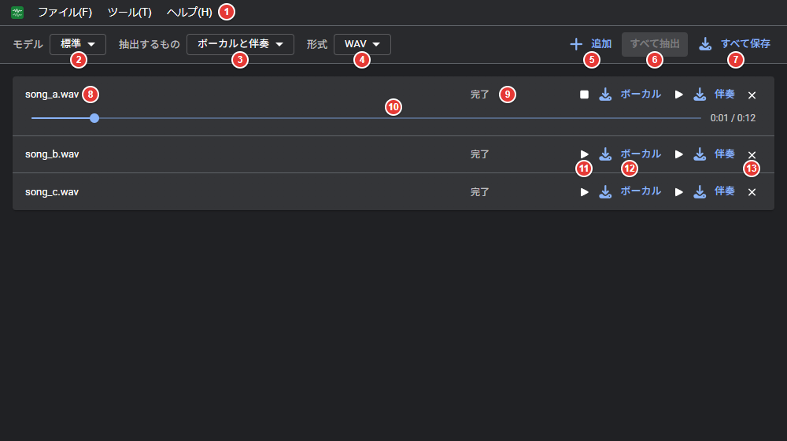
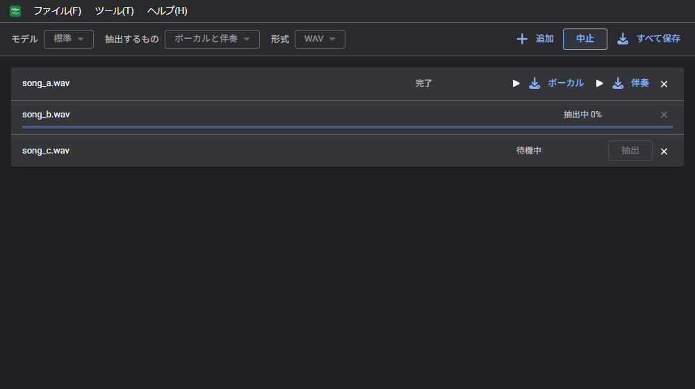
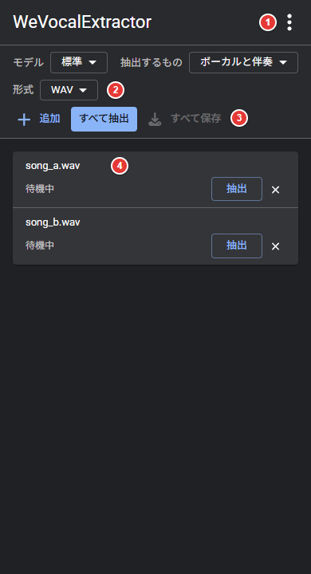
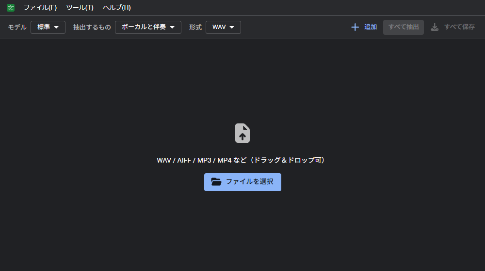
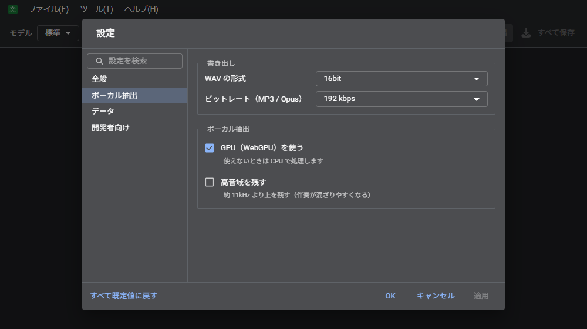

# 使い方
WeVocalExtractor の操作方法をまとめた説明書。 
曲のファイルを追加して、ボーカルと伴奏に分け、保存するまでの流れと、各機能の使い方を記載する。

## 目次

- [用語](#用語)
- [画面](#画面)
  - [パソコン](#パソコン)
  - [スマホ](#スマホ)
- [基本の流れ](#基本の流れ)
- [開けるファイル](#開けるファイル)
- [オフラインとデータの保存](#オフラインとデータの保存)
- [抽出の設定](#抽出の設定)
- [一覧の操作](#一覧の操作)
- [保存](#保存)
- [設定](#設定)
- [キーボード操作](#キーボード操作)
- [困ったとき](#困ったとき)

## 用語

| 用語 | 意味 |
| --- | --- |
| ボーカル | 曲の中の歌声 |
| 伴奏 | 曲からボーカルを除いた残り（楽器・ドラムなど） |
| 抽出 | 曲をボーカルと伴奏に分けること |
| モデル | 抽出に使うデータ。初回にダウンロードし、ブラウザに保存する |
| 一覧 | 追加した曲の並び。上から順に抽出する |

## 画面

### パソコン

| 番号 | 場所 | 内容 |
| --- | --- | --- |
| 1 | メニューバー | ファイル、ツール、ヘルプ |
| 2 | モデル | 軽量・標準・高精度から選ぶ（[抽出の設定](#抽出の設定)） |
| 3 | 抽出するもの | ボーカルと伴奏・ボーカルだけ・伴奏だけ |
| 4 | 形式 | 保存する形式（WAV / MP3 / Opus） |
| 5 | 追加 | 曲のファイルを一覧に足す |
| 6 | すべて抽出 / 中止 | 待機中の曲を順に抽出する。抽出中は「中止」になる |
| 7 | すべて保存 | 抽出した結果を ZIP にまとめて保存する |
| 8 | ファイル名 | 追加した曲の名前 |
| 9 | 状態 | 待機中・抽出中（進み具合）・完了・失敗 |
| 10 | 再生位置 | 試聴中の曲に出る。ドラッグで位置を移す |
| 11 | 試聴 | 結果を再生する。もう一度押すと止まる |
| 12 | 保存 | 「ボーカル」「伴奏」を押すと、その結果を保存する |
| 13 | 外す | 曲を一覧から外す |

メニューバーはキーボードでも操作できる。Alt（単独で押して離す）か F10 でメニューバーに入り、「ファイル(F)」の F などでそのメニューを開く。

| メニュー | 項目 |
| --- | --- |
| ファイル(F) | 追加（Ctrl+O）、すべて保存 |
| ツール(T) | すべて抽出、一覧を空にする、設定 |
| ヘルプ(H) | ショートカット一覧、このアプリについて |

抽出中の画面

### スマホ

| 番号 | 場所 | 内容 |
| --- | --- | --- |
| 1 | メニュー（⋮） | 追加、すべて保存、設定など |
| 2 | 抽出の設定 | モデル、抽出するもの、形式 |
| 3 | 一覧の操作 | 追加、すべて抽出、すべて保存 |
| 4 | 一覧 | 曲ごとの状態と操作。パソコンの 1 行を 2 行に折り返す |

## 基本の流れ

1. **追加する**: 曲のファイルを画面にドラッグ＆ドロップするか、「ファイルを選択」「追加」（Ctrl+O）で選ぶ。複数まとめて追加できる
2. **選ぶ**: モデル、抽出するもの、形式を選ぶ
3. **抽出する**: 「すべて抽出」を押す。上から 1 曲ずつ抽出する。1 曲だけなら、その行の「抽出」を押す
4. **聴く**: 完了した曲の ▶ で結果を試聴する
5. **保存する**: 行の「ボーカル」「伴奏」で 1 つずつ、「すべて保存」でまとめて保存する

## 開けるファイル

| 種類 | 例 |
| --- | --- |
| 音声ファイル | WAV、AIFF、MP3、M4A（AAC）、FLAC、Ogg など（ブラウザによって読めないものがある） |
| 動画ファイル | MP4（中の音声だけを使う） |

## オフラインとデータの保存

- 曲はパソコンやスマホの外に送られない。抽出はすべてブラウザの中で行う
- モデルは初回の抽出でダウンロードし、ブラウザに保存する。2 回目からはダウンロードしない
- 一度開いたあとは、ネットにつながっていなくても使える（使うモデルを保存していれば）
- ブラウザの「インストール」（ホーム画面に追加）で、アプリのように起動できる
- 閉じたあとも、一覧と結果を残せる（[設定](#設定) の「データ」）

## 抽出の設定

| 項目 | 内容 |
| --- | --- |
| モデル | 軽量（約 38MB）、標準（約 50MB）、高精度（約 75MB）。重いほど分離の精度が上がるが、ダウンロードが大きい |
| 抽出するもの | ボーカルと伴奏、ボーカル、伴奏 |
| 形式 | WAV、MP3、Opus。WAV のビット数と MP3 / Opus のビットレートは設定で選ぶ |

- 抽出中は変えられない
- 曲を約 12 秒ずつに分けて処理するので、長い曲やスマホでも抽出できる

## 一覧の操作

| 操作 | 動作 |
| --- | --- |
| すべて抽出 | 待機中の曲を上から順に抽出する |
| 抽出（行） | その曲だけを抽出する。失敗した曲のやり直しにも使う |
| 中止 | 抽出を止める。途中までの結果は使わない |
| ▶ / ■ | 結果を試聴する / 止める。鳴るのは 1 つだけ |
| × | 曲を一覧から外す（抽出中の曲は外せない） |
| ツール → 一覧を空にする | すべての曲を外す |

モデルを初めて使うときは、抽出の前に「モデルを取得中… ○%」と出る。

## 保存

| 操作 | 内容 |
| --- | --- |
| 行の「ボーカル」「伴奏」 | その結果を 1 つ保存する |
| すべて保存 | 抽出した結果を、まとめて `wevocalextractor.zip` で保存する |

- ファイル名は「元のファイル名_vocals」「元のファイル名_accompaniment」になる
- 形式は、抽出したときに選んでいた形式になる

## 設定

「ツール → 設定…」（スマホは ⋮ → 設定）。

| 分類 | 項目 |
| --- | --- |
| 全般 | テーマ（システムに合わせる、ライト、ダーク）、言語、アップデートの確認 |
| ボーカル抽出 | WAV の形式（16bit / 24bit / 32bit float）、ビットレート（MP3 / Opus。128〜320 kbps）、GPU（WebGPU）を使う、高音域を残す |
| データ | 閉じたあとも一覧を残す、ダウンロードしたモデルの削除、残した一覧の削除 |
| 開発者向け | ダイアログの表示 |

| 項目 | 内容 |
| --- | --- |
| GPU（WebGPU）を使う | 対応しているブラウザでは速くなる。使えないときは CPU で処理する |
| 高音域を残す | 約 11kHz より上を残す。声は明るくなるが、伴奏が混ざりやすい |
| 閉じたあとも一覧を残す | 未ダウンロードの結果のみ（既定）、ダウンロードした結果も、残さない |

設定画面の操作（検索、OK・キャンセル・適用、すべて既定値に戻す）は WeVocalSynth と同じ。

## キーボード操作

| キー | 動作 |
| --- | --- |
| Ctrl+O | ファイルを追加 |
| Alt / F10 | メニューバーに入る |

ファイルは画面のどこにドロップしても追加される。一覧は「ヘルプ → ショートカット一覧」でも見られる。

## 困ったとき

| 症状 | 対処 |
| --- | --- |
| 声と伴奏がうまく分かれない | モデルを「高精度」に変える |
| 抽出したボーカルにシンバルなどが混ざる | 「高音域を残す」を OFF にする |
| 抽出したボーカルがこもって聞こえる | 「高音域を残す」を ON にする |
| 抽出が遅い | モデルを「軽量」にするか、「GPU（WebGPU）を使う」を ON にする |
| 抽出が失敗する・結果がおかしい | 「GPU（WebGPU）を使う」を OFF にする。スマホではモデルを「軽量」にする |
| ファイルが開けない | WAV か MP3 に変換してから追加する |
| ブラウザの容量が足りない | 設定の「データ」で、使わないモデルや残した一覧を削除する |
